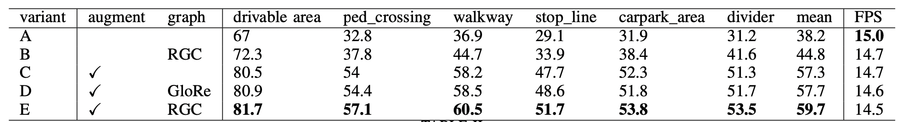

# Residual Graph Convolutional Network for Bird”s-Eye-View Semantic Segmentation (WACV 2024)
- [Residual Graph Convolutional Network for Bird”s-Eye-View Semantic Segmentation](https://openaccess.thecvf.com/content/WACV2024/papers/Chen_Residual_Graph_Convolutional_Network_for_Birds-Eye-View_Semantic_Segmentation_WACV_2024_paper.pdf)

## Main Results
### Nuscenes BEV Map Segmentation

- Variant A represents BEVDet(BEVDet: High-performance Multi-camera 3D Object Detection in Bird-Eye-View) with a segmentation head     
- Augment represents data augmentation    
- RGC represents the important proposed Residual Graph Convolutional layers, whose code is provided

## Requirements
- torch == 1.9.0

## Get Started
python RGCA.py
The inputs of Residual Graph Convolutional Layers are randomly generated, and the size of outputs is the result of RGCA.py. Residual Graph Convolutional Layers could be easily applied to any networks and the main results of Nuscenes BEV Map Segmentation are promising. 

The rest of Residual Graph Convolutional Network will be posted later.

